# Library Management Web Application

A Web Application for Librarians to manage their library.

### Features  

1. Import and Manage Books
2. Maintain Book Stock
3. Manage Members
4. Issue, return and charge rent fees for Books

### Installation

Assuming that you have already installed [`poetry`](https://python-poetry.org), clone the repository and run the following commands:

* For Linux  

```bash
$ ./install.sh
```  

* For Windows

```ps1
> .\install.ps1
```

### Screenshots  

<figure>
    <figcaption>Books</figcaption>
    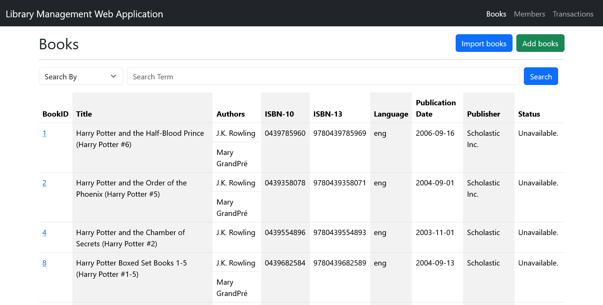
</figure>

<figure>
    <figcaption>Import Books</figcaption>
    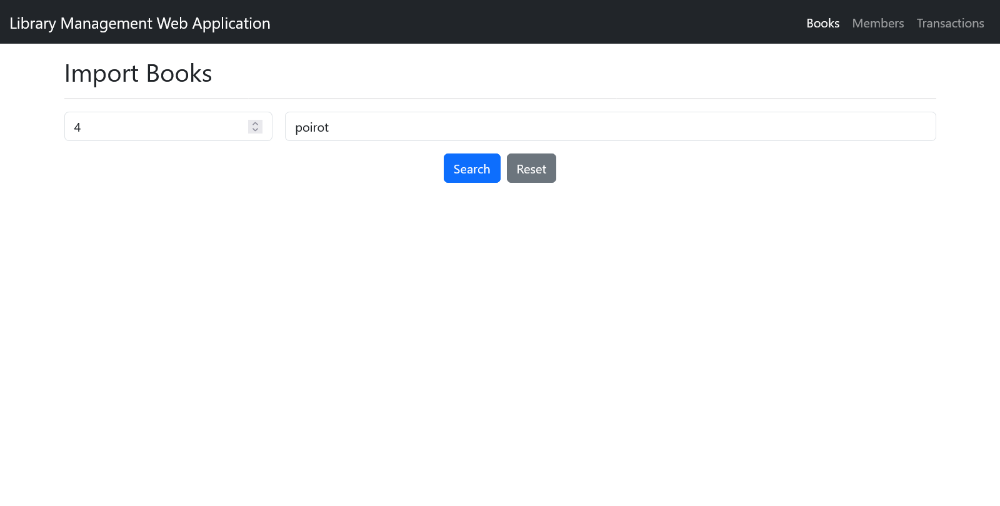
</figure>

<figure>
    <figcaption>Confirm Import Books</figcaption>
    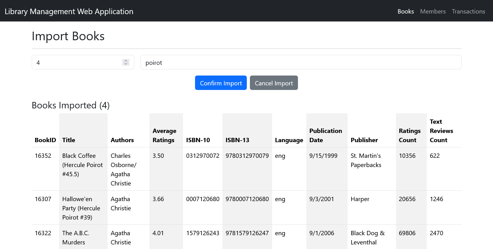
</figure>

<figure>
    <figcaption>Book details</figcaption>
    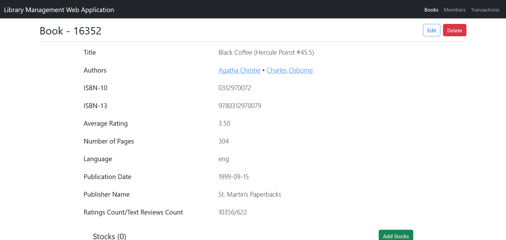
</figure>

<figure>
    <figcaption>Delete Book</figcaption>
    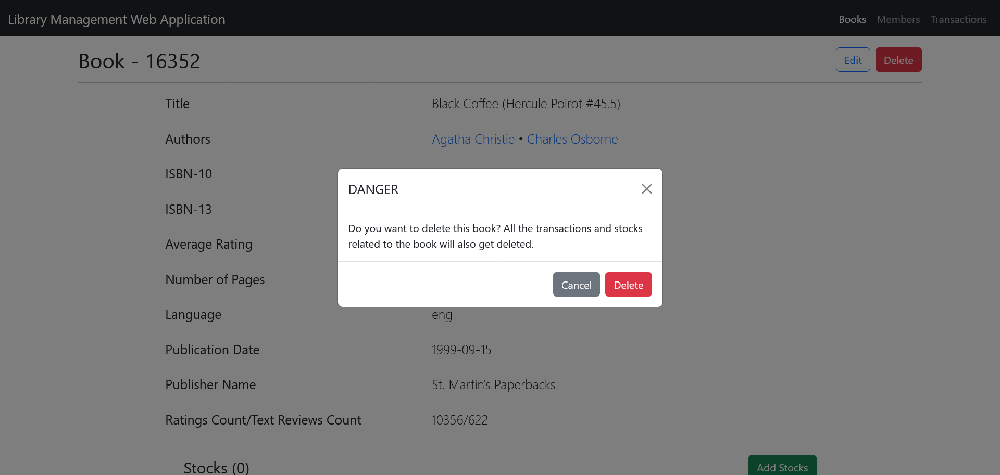
</figure>

<figure>
    <figcaption>Add Book Stock</figcaption>
    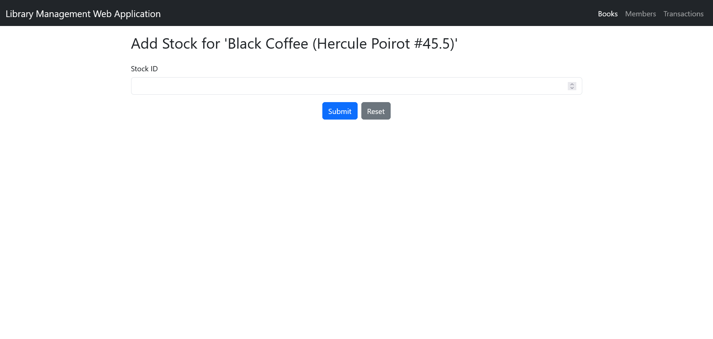
</figure>

<figure>
    <figcaption>Edit Book details</figcaption>
    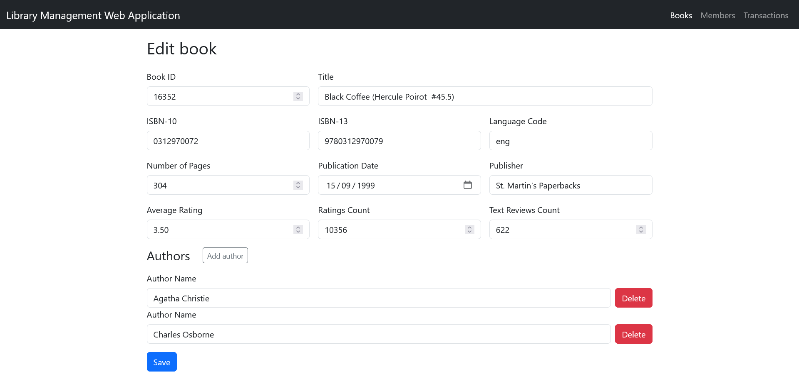
</figure>

<figure>
    <figcaption>Members</figcaption>
    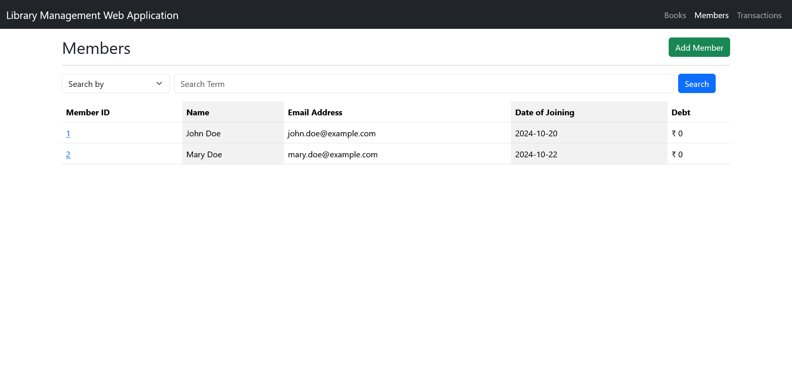
</figure>

<figure>
    <figcaption>Add Member</figcaption>
    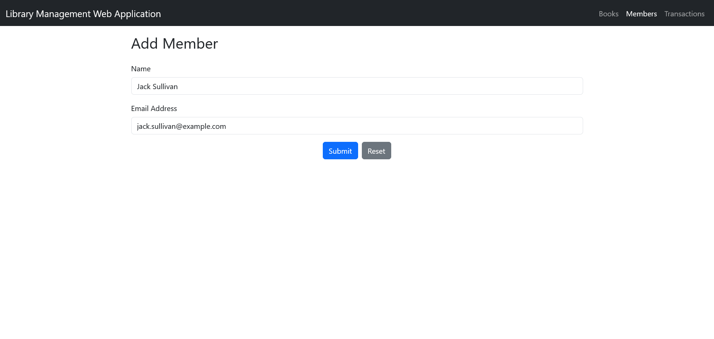
</figure>

<figure>
    <figcaption>Member Details</figcaption>
    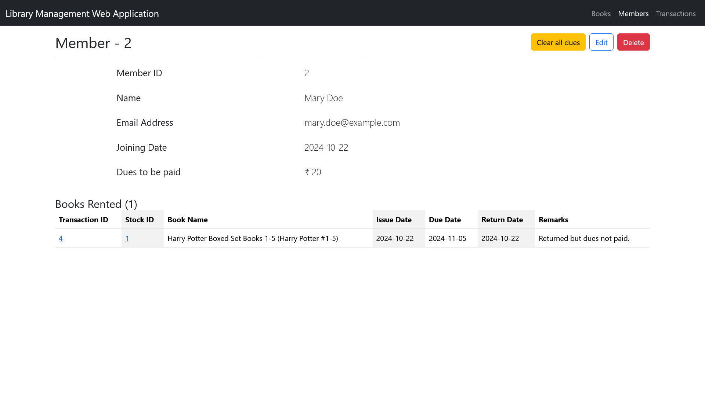
</figure>

<figure>
    <figcaption>Transactions</figcaption>
    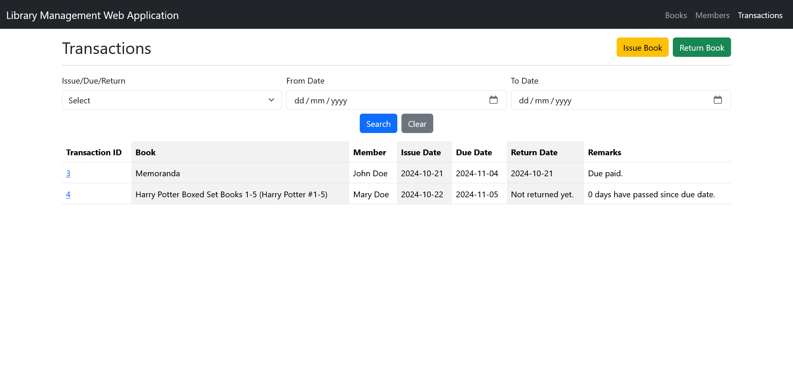
</figure>

<figure>
    <figcaption>Search and Issue Book</figcaption>
    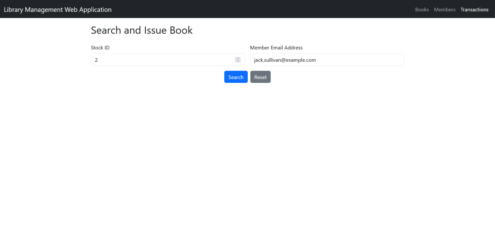
</figure>

<figure>
    <figcaption>Confirm Book Issue</figcaption>
    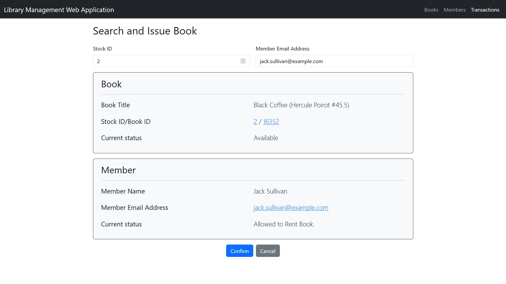
</figure>

<figure>
    <figcaption>Issued Book Transaction Details</figcaption>
    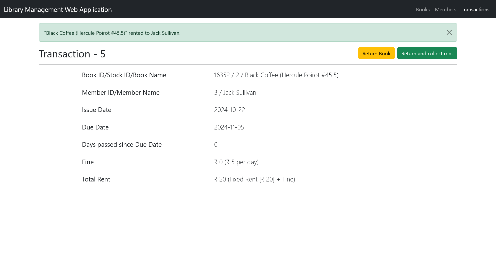
</figure>

<figure>
    <figcaption>Return Book</figcaption>
    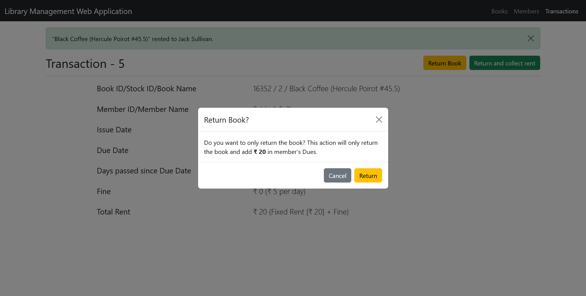
</figure>

<figure>
    <figcaption>Return Book and Pay Rent</figcaption>
    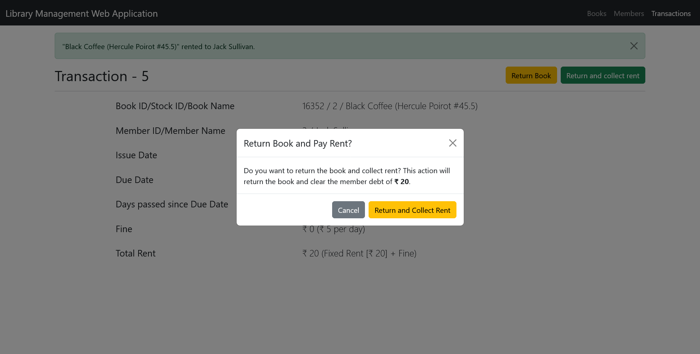
</figure>

<figure>
    <figcaption>Book returned but Rent not paid</figcaption>
    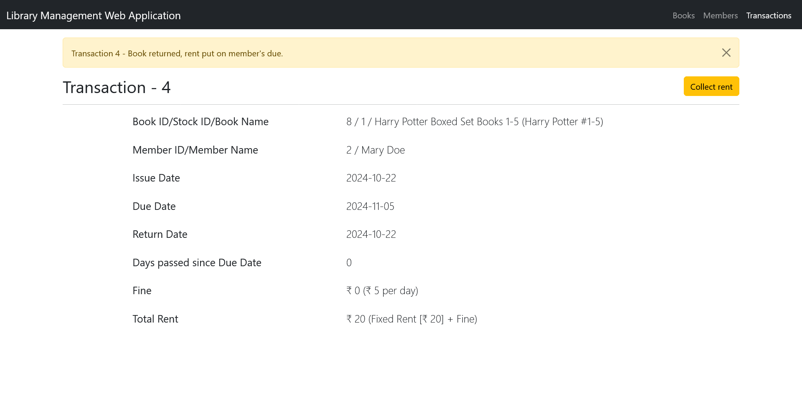
</figure>

<figure>
    <figcaption>Collect Rent for Returned Book</figcaption>
    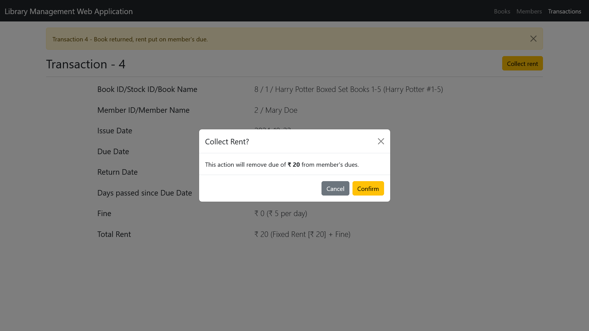
</figure>

---